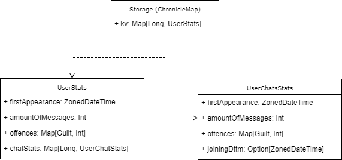

## Storage description
Bot needs statistics to make decisions about guilts. Statistics contains general counter of messages, counter of infringements and stats per chat. As storage ChronicleMap is used - extremely simple db with portable files.

`StatsService` class is responsible for datum writing and reading. Serialization and deserialization are implemented via protobuf 2.

## Run
Add 'application.conf' file to classpath with one parameter: `bot-token="token_of_your_bot"`. You can create and manage your bots via [Bot Father](https://telegram.me/botfather)