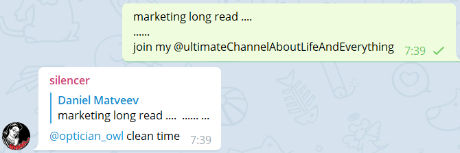
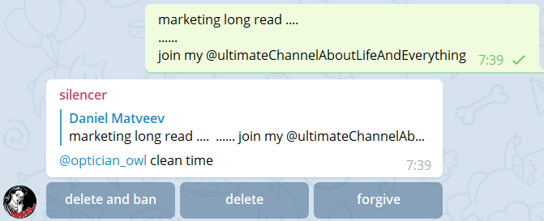

# Telegram Silencer

Your kind censor of telegram chats

## Usage
Add [silencer bot](https://t.me/why_rebecca_bot) to group. 
Every time a forbidden message appears bot send notification to administrators of a group.

If bot is an administrator then notification goes with fast action buttons.

## FAQ
1. Why does not bot remove messages automatically?

At first there is a chance of false positive detection. For example when a new member of chat uses url not from whitelist and message does not violate chat rules.
At second there is no mechanism of action rollback yet. So execution of an innocent member would be fast and silent.

It'll be implemented but not so soon, because requires a lot of modification.

## Details
Look into [CONTRIBUTING](./CONTRIBUTING.md)